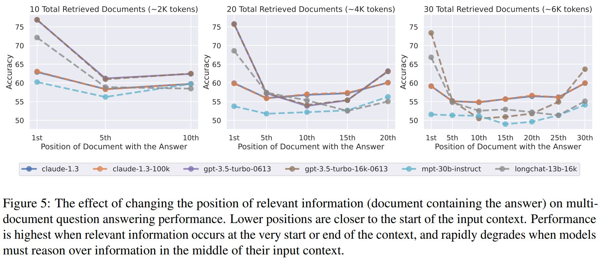

# 🧠 Understanding Memory in LLMs

By default, LLMs like GPT do not come with memory.  
But what does it really mean to **give memory** to a language model?

Memory is not something built into the model itself.  
Instead, it's an external system — a combination of:

- ✅ Tools  
- ✅ Databases  
- ✅ Strategies  

Together, these simulate memory by:
- Deciding **what to store**
- Figuring out **how to retrieve it later**
- And most importantly, **how to insert the retrieved data into the model's prompt** to guide its behavior

## 📊 Visualizing the Memory System

In this schema, we break down how an intelligent, memory-aware system builds prompts dynamically.

The LLM receives **structured input**, made up of several components:

- **🧾 Instructions**: Rules that guide the model's tone, goals, and behavior
- **🙋 User Info**: Pulled from databases, this may include preferences, personality, or history
- **🧠 Chat History Summary**: Condensed summaries of older conversations
- **💬 Chat History**: Recent messages from the user and assistant
- **🔧 Tool Explanation**: Information about available tools the model can call
- **📥 Function Call Results**: Outputs from previous tool interactions
- **📚 Few-Shot Examples**: Examples to help guide the model's reasoning
- **❓User's Latest Question**: The new input from the user

This layered input is all within the LLM's context window and is updated continuously.

---

## 🗃️ External Databases as Memory Sources

To populate the prompt, the system pulls from various external memory sources:

- **🟣 Vector Database (VectorDB)**: Stores past interactions as embeddings and enables *semantic search*
- **🟢 SQL Database**: Stores structured history, user settings, or tool logs
- **🟠 Graph Database**: Stores structured relationships and user modeling (e.g., interests, friends, goals)

These databases provide the "long-term memory" that the LLM itself lacks.

---

## 🧩 Smart Prompt Construction is Key

The real value lies in **how** memory is used — not just where it's stored.

A smart system will:
- Retrieve only what's relevant
- Inject it into the right part of the prompt
- Update and adapt the memory based on feedback and actions

The result is a chatbot that appears consistent, aware, and helpful across conversations, even though the model itself has no actual memory.

---

## 🧾Lost in the Middle

[Paper](https://arxiv.org/pdf/2307.03172)

---

> ✅ Memory in LLMs is not magic — it's a system design.  
> The better your design, the smarter and more helpful your assistant becomes.

---
