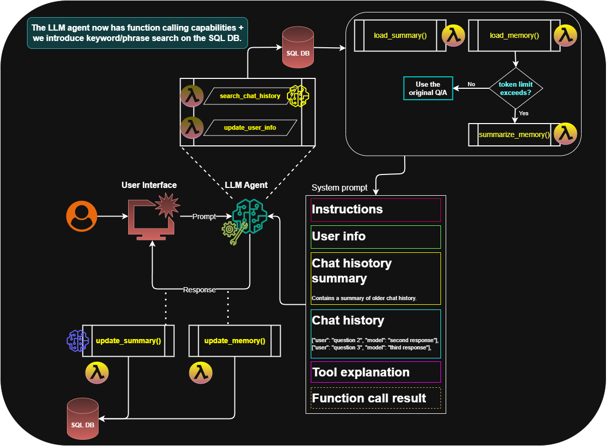

# 🧠 Agentic Chatbot v2

This version of the chatbot transforms the assistant into an **interactive agent** that can **call tools**, retrieve information, and update user data, all using OpenAI's function calling system.

This is where we start to introduce **agentic behavior** and **custom function execution** into the flow.

## 🔍 Core Functionalities

### 1. 🧱 Initialization

Much like the basic chatbot, the core components are initialized:
- OpenAI client, model configs, session ID, etc.

But this version **adds new capabilities**, including:

- `Utils`: Converts Python functions into OpenAI-compatible JSON schemas
- `SearchManager`: Allows the chatbot to query the SQL database using **keyword or phrase-based search**
- `agent_functions`: A list of callable tools for the agent, including:
  - `add_user_info_to_database`
  - `search_chat_history`

---

### 2. ⚙️ Function Execution

When the LLM calls a function:
- The chatbot extracts the function name and arguments
- Executes the corresponding method using `execute_function_call`
- Returns both the **execution state** (e.g., success/failure) and the **result**

---

### 3. 🔁 Conversational Loop

This is where the agentic behavior shines:

- The chatbot runs in a **loop** until the conversation is complete
- It builds a **dynamic system prompt** that includes:
  - User profile
  - Chat history
  - Summary
  - Previous tool calls and results

- The LLM decides whether to:
  - Respond directly
  - Call a function
  - Loop again with the new context

- There's also a cap on function calls to avoid infinite loops or unnecessary tool usage.

---

## 🔄 Key Differences vs. Basic Chatbot

| Feature | **Basic Chatbot** | **Agentic Chatbot v2** |
|--------|-------------------|-------------------------|
| **Chat Flow** | One-step response | Multi-step agentic loop |
| **Function Calling** | ❌ None | ✅ OpenAI tools supported |
| **Abilities** | Only responds | Updates DB, searches, adapts |
| **Search Capability** | ❌ None | ✅ Phrase-based SQL search |
| **Prompt Strategy** | Simple prompt | Prompt with call context |
| **Error Handling** | Basic errors | Full tracebacks |
| **Memory Handling** | Short-term only | Tracks function call memory |

---

## 🧠 Takeaway

This chatbot acts more like an **autonomous assistant** — capable of reasoning, calling tools, and adjusting its output based on retrieved information.

It bridges the gap between a passive chatbot and a goal-driven AI agent.

---

## 🧾 Architecture Overview

Here's the architecture of Agentic Chatbot v2:

