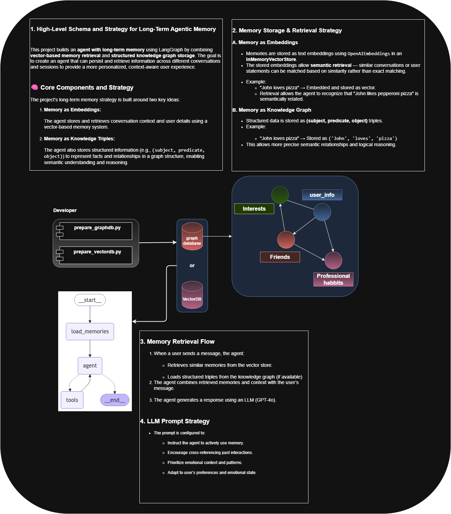

## 🧩 Frameworks for Building Agentic Memory: Theory Before Code

Now that we understand how memory works in theory — and have seen how we can design our own chatbot agents to support custom memory systems — let's talk about frameworks.

As this space continues to grow rapidly, **frameworks play a huge role** in shaping how memory architectures are implemented in practice.

---

### 🥇 LeTTA

While I give LeTTA full credit for moving this field forward, I personally **do not recommend adopting their standalone framework** — at least not for production use.

Here’s why:
- It’s relatively new and lacks long-term support
- Bigger platforms like LangChain are already **integrating similar capabilities**, which means higher maintainability, better documentation, and a broader ecosystem
- The code that they provided in their online course a few months ago already does not work.

---

### 🔄 Enter LangChain: The Production-Ready Option

While I was developing this project, **LangChain integrated native support for long-term memory** into their agent framework — and they did it impressively well.

They currently offer **two main strategies** for memory-aware agents. Let’s look at the first one.

---

### 🧠 Strategy 1: Hybrid Memory with Vector + Graph Stores

As shown in the diagram, LangChain agents can now be configured to:
- Use **Vector Databases** to perform semantic retrieval over past messages or facts
- Use **Graph Databases** to build structured profiles of users — like their interests, relationships, preferences, and behaviors

This combination creates a powerful foundation for:
- Personalized reasoning
- Persistent user modeling
- Adaptive, long-term conversations

🧩 And what makes this really exciting is that LangChain handles the **retrieval**, **context construction**, and **prompt formatting** internally.

---

### 💻 Let’s See It in Action

Now that we understand the theory, I’ll show you how to actually implement this in LangChain.

We’ll walk through the code, see how to:
- Set up memory stores,
- Configure an agent,
- And watch how it retrieves, combines, and uses memory in real-time.

Let’s dive in.
