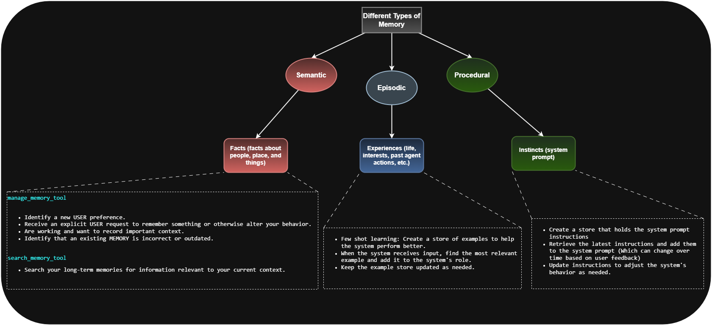
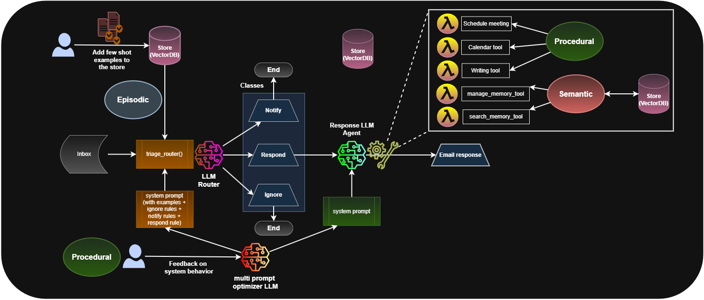

# 🧠 LangChain's Second Strategy for Long-Term Memory

LangChain recently introduced a second approach to agent memory — inspired by **how humans organize memory**.

This design was shared by LangChain's CEO during a course with DeepLearning.AI, and it's structured around three types of memory:  
**Semantic, Episodic, and Procedural**.

---

## 🧩 Types of Memory Modeled

### 1. Semantic Memory
- Stores **factual knowledge** about the world or the user  
- Examples:
  - “User prefers morning meetings”
  - “John's favorite food is pizza”
- Stored in a **VectorDB** for semantic similarity retrieval

### 2. Episodic Memory
- Stores **past experiences** and events  
- This includes full or summarized chat interactions, task logs, and personal anecdotes  
- Helps the agent remember “what happened”

### 3. Procedural Memory
- Stores **instincts or learned behaviors**  
- These are injected into the **system prompt** and define how the agent should behave  
- Example:
  - “Always greet the user warmly”
  - “Maintain a formal tone with this user”

---

## ⚙️ How It Works — The Memory Pipeline

LangChain uses a **triage mechanism** to decide where new memories should go:

- Is it a fact? → Store in **Semantic Memory**
- Is it a past event or story? → Store in **Episodic Memory**
- Is it behavioral guidance? → Store in **Procedural Memory**

Then, when the user sends a new message:
1. The system **analyzes and routes the memory** appropriately
2. It **retrieves relevant past context** from the different memory types
3. It **builds a dynamic system prompt** with updated facts, experiences, and behavior rules
4. The LLM generates a response based on this enriched context

---

## 🔧 Tools Used by the Agent

To interact with these memory types, LangChain uses dedicated tools:

- `manage_memory_tool` – update or revise memory entries  
- `search_memory_tool` – retrieve semantic or episodic data  
- `writing_tool`, `calendar_tool`, `scheduling_tool` – perform tasks based on remembered facts  

The LLM can call these tools **intelligently and autonomously** depending on the context.

It can:
- Take actions
- Decline to act
- Or ask the user for clarification

---

## 🗺️ Architecture Overview

This architecture supports:
- Adaptive memory routing
- Real-time context injection
- Human-like memory segmentation

It's one of the most **comprehensive and flexible** memory strategies in production-ready LLM systems today.

---

## 👨‍🏫 Let's See It in Action

Now let's step into the code.

We'll explore:
- How memories are created and stored
- How LangChain routes and retrieves them
- And how the agent uses this layered memory to behave intelligently in real time

Let's dive in.
